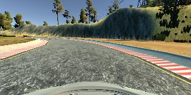
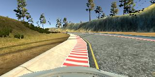
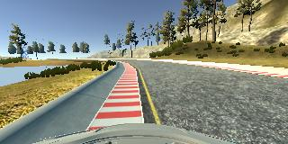
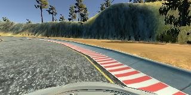
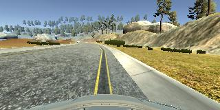

# **Behavioral Cloning** 

---

**Behavioral Cloning Project**

The goals / steps of this project are the following:
* Use the simulator to collect data of good driving behavior
* Build, a convolution neural network in Keras that predicts steering angles from images
* Train and validate the model with a training and validation set
* Test that the model successfully drives around track one without leaving the road
* Summarize the results with a written report

More complete instructions are given in the [Project Instructions](./project_instructions.md).

## Rubric Points
### Here I will consider the [rubric points](https://review.udacity.com/#!/rubrics/432/view) individually and describe how I addressed each point in my implementation.  

---
### Files Submitted & Code Quality

#### 1. Submission includes all required files and can be used to run the simulator in autonomous mode

My project includes the following files:
* model.py containing the script to create and train the model
* drive.py for driving the car in autonomous mode
* model.h5 containing a trained convolution neural network 
* writeup_report.md summarizing the results

#### 2. Submission includes functional code
Using the Udacity provided simulator and my drive.py file, the car can be driven autonomously around the track by executing 
```sh
python drive.py model.h5
```

#### 3. Submission code is usable and readable

The model.py file contains the code for training and saving the convolution neural network. The file shows the pipeline I used for training and validating the model, and it contains comments to explain how the code works.

### Model Architecture and Training Strategy

#### 1. An appropriate model architecture has been employed

My model consists of a convolution neural network with 5x5 filter sizes and depths between 6 and 500 (the convolutional layer depths ranged from 6 to 48) (model.py lines 154-174) 

The model includes RELU layers to introduce nonlinearity (code lines 159, 163, 167), and the data is normalized in the model using a Keras lambda layer (code line 156). 

#### 2. Attempts to reduce overfitting in the model

The model uses L2 regularization in order to reduce overfitting (model.py lines 160, 164, 168). 

The model was trained and validated on different data sets to ensure that the model was not overfitting (code lines 93-96, 108-109, 112-113). The model was tested by running it through the simulator and ensuring that the vehicle could stay on the track.

#### 3. Model parameter tuning

The model used an adam optimizer, so the learning rate was not tuned manually (model.py line 174).

#### 4. Appropriate training data

Training data was chosen to keep the vehicle driving on the road. I used a combination of center lane driving and recovering from the left and right sides of the road for both of the tracks in the simulator.

For details about how I created the training data, see the next section. 

### Model Architecture and Training Strategy

#### 1. Solution Design Approach

The overall strategy for deriving a model architecture was to use a convolutional neural netowrk that has already been proven to be useful for image analysis. Initially I tried the [Nvidia self driving car](https://devblogs.nvidia.com/deep-learning-self-driving-cars/) CNN architecture but I was running into issues exausting the memory resources of my computer during training. Next I tried to make use of the VGG architecture but the loss dirverged when I tried this approach. My final architecture was an adaptation of LeNet as it provided a useful CNN architecture that was small enough for my computer to handle.

In order to gauge how well the model was working, I split my image and steering angle data into a training and validation set and fed both data sets into the Keras `fit_generator()` function. 

To combat the overfitting, I included L2 regularization in all of the layers so that any large weight values would be penalized. I tried using dropout layers initially but performance was suffering and I was uncertain if these dropout layers were being carried forward when the model was saved thus affecting the performance when testing the car on the simulator.

Next I altered the layer depths, the batch size and the number of epochs until satsifactory performance with the squared mean error loss was reached. The final squared mean error loss settled around 0.095 for the architecture.

The final step was to run the simulator to see how well the car was driving around track one. There were a few spots where the vehicle fell off the track or would mount the curb. In order to improve the driving behavior in these cases, I went back to the simulator and recorded multiple recovery loops at the problematic locations.

At the end of the process, the vehicle is able to drive autonomously around the track without leaving the road.

#### 2. Final Model Architecture

The final model architecture (model.py lines 154-174) consisted of a convolution neural network with the following layers and layer sizes:

| Layer         		|     Description	        					| 
|:---------------------:|:---------------------------------------------:| 
| Input         		| 160x320x3 image                        		| 
| Lambda         		| Normalization                         		| 
| Cropping         		| 65x320x3 image                         		| 
| __Layer 1:__         	|    							                | 
| Convolution 5x5     	| 1x1 stride, valid padding, outputs 61x316x6 	|
| Activation			| RELU											|
| Max pooling	      	| 2x2 stride,  outputs 30x158x6 				|
| __Layer 2:__         	|    							                | 
| Convolution 5x5     	| 1x1 stride, valid padding, outputs 26x154x24 	|
| Activation			| RELU											|
| Max pooling	      	| 2x2 stride,  outputs  13x77x24   				|
| __Layer 3:__         	|    							                | 
| Convolution 5x5     	| 1x1 stride, valid padding, outputs 9x73x48 	|
| Activation			| RELU											|
| Max pooling	      	| 2x2 stride,  outputs  4x36x48   				|
| __Flatten:__         	| outputs 6912       			                | 
| __Layer 4:__         	|    							                | 
| Fully Connected     	| outputs 500 	                                |
| __Layer 5:__         	|    							                | 
| Fully Connected     	| outputs 120 	                                |
| __Layer 6:__         	|    							                | 
| Fully Connected     	| outputs 1 	                                |


#### 3. Creation of the Training Set & Training Process

To capture good driving behavior, I first recorded three laps on track one in both clockwise and counter-clockwise dirctions (6 laps total) using center lane driving. Here is an example image of center lane driving:



I then recorded the vehicle recovering from the left side and right sides of the road back to center so that the vehicle would learn the steering angles it needs when it finds itself off center. These images show what a recovery looks like starting from the left and right sides of the track:


  



Then I repeated three laps clockwise and counter-clockwise collection on track two in order to get more data points and increase the variety of the data so that the model doesn't simply memorize track one.

To augment the data set, I also flipped images and angles provide additional images for the model to train to. Since the images are mirrors of the original set they essentially provide the model another track example. In addition, I extended the data set with images that were scaled from 0.9 to 1.1. These augmentations should help prevent the model from overfitting by providing a larger and more varied image set.

After the collection process, I had 55224 data points. The only preprocessing of the data in additional to normalizing the image set was to crop the top and bottom of the image. This way the model will train to the road rather than including the hood of the car or the other natural features. There were other things I wanted to try but I had to keep in mind that the `drive.py` file would also have to be able to perform the preprocessing and so I had to stick with what I could fit in the keras layers. Such ideas included stacking the left and right images with the center image creating a new input depth of 9 or to include grayscale and hsv versions of the images (also altering the input depth). These ideas provide avenues for further exploration. 

I finally randomly shuffled the data set and put 33% of the data into a validation set. 

I used this training data for training the model. The validation set helped determine if the model was over or under fitting. The ideal number of epochs was 10 as it allowed the model to begin to plateau but not cause excessive overfitting. I used an adam optimizer so that manually training the learning rate wasn't necessary.

### Simulation

#### 1. Car Able To Navigate Track 1 Successfully

The file run1.mp4 shows the car navigating the track successfully at a set speed of 9 mph. I've also included a video of the car navigating the track with a set speed of 30 mpg (run_fast.mp4). This shows the robustness of the trained model as the car has less time to react when correction is needed when traveling at 3x the speed of the original video.

I also independently tested the model on track two. It starts off alright but loses the ability to distinguish what the steering angle should be when it enters a shaded region.